# Squatch Smash campaign flow and polish report

Date: 2026-08-08
Campaign schema: v14
Application: v0.1.0
Working branch: `codex/final-campaign-stitch-polish-20260807`

This is the current production handoff. It separates verified engineering
facts from recording work and owner decisions. The `8-6` playtest note is the
live defect brief. The second pasted note was used as a regression and design
lessons list, not as permission to rebuild approved scenes.

## Protected boundaries

- The Margo come-home dress-help sequence is frozen exactly as it is. Its
  dialogue, poses, staging, timing, camera, sound, reveal, and mechanic are not
  part of this pass.
- `initiation.html` and `src/initiation/**` are frozen pending the owner's human
  playtest. The campaign may enter Initiation and leave it `in_progress`; it
  may not rewrite or complete that scene in this pass.
- Existing apartment days, Golf, THE TAKE, and every connected mission remain
  playable. The final chapter extends the campaign rather than replacing its
  four-day spine.

## Whole campaign flow

```mermaid
flowchart TD
  A1["Apartment - Day 1 morning"] --> B1["Bada Bing - first visit"]
  B1 --> A1R["Apartment - whiskey nerve-settle"]
  A1R --> SF["The Squatchfather"]
  SF --> S1["Apartment - sleep"]

  S1 --> A2["Apartment - Day 2 morning"]
  A2 --> BR["Beef Run"]
  BR --> A2R["Apartment - Lou call"]
  A2R --> HD["Bada Bing - HotDog Incident"]
  HD --> GY["Squatch Graveyard"]
  GY --> JM["Jerky Motel"]
  JM --> S2["Apartment - sleep"]

  S2 --> A3["Apartment - Day 3 noon"]
  A3 --> NW["NO WAKE"]
  NW --> A3R["Apartment - Margo call"]
  A3R --> FC["Front and Center"]
  FC --> MH{"Margo comes home?"}
  MH -->|"Yes"| A9["Apartment 09 - approved one-shot night"]
  MH -->|"No"| S3["Apartment - sleep"]
  A9 --> S3

  S3 --> A4["Apartment - Day 4 morning"]
  A4 --> GP["Silver Pines"]
  GP --> HP["Apartment - THE TAKE preparation"]
  HP --> TK["THE TAKE"]
  TK --> HC["Apartment - post-heist cleanup"]

  HC --> SC["The Silver Case"]
  SC --> MS["Lou's Mansion / PROJECT SILENT SQUATCH"]
  MS --> QE["Quiet mansion evening"]
  QE --> BED["Guest-room sleep seam"]
  BED --> SG["Mansion Under Siege"]
  SG --> EN["Enola Squatch"]
  EN --> MR["Repaired Mansion return briefing"]
  MR --> CP["Cartel Palace - Mark and Sauce"]
  CP --> IN["Initiation - entered in_progress; frozen"]
```



The preservation-first placement starts the final chapter after THE TAKE
cleanup. This keeps every completed mission and apartment iteration. Moving
the final chapter to immediately after Front and Center remains an owner choice
and does not require changing the individual final-scene contracts.

## Final chapter contracts

| Runtime | Required campaign result | Next scene |
|---|---|---|
| The Silver Case | Recover the same closed Silver Case and persist the apartment outcomes | Lou's Mansion |
| PROJECT SILENT SQUATCH | Deliver the real case, finish the lab, then enter a playable quiet-evening phase | Mansion Under Siege |
| Mansion Under Siege | Persist checkpoints and the battle result; Captain Lou Sasole takes over the handoff | Enola Squatch |
| Enola Squatch | Persist the real mission score, payload, unlocks, and return result | Repaired Mansion return |
| Mansion return | Confirm the wrong-city fallout, Sauce's apparent disappearance, and Mark's estate | Cartel Palace |
| Cartel Palace | Reveal Sauce as traitor, defeat armored Mark and armed Sauce, extract | Initiation |
| Initiation | Enter `in_progress` | Protected terminal WIP |

Every handoff is exact-once, preview-isolated, and backed by campaign schema
v14 migration rules. Existing saves legitimately at Initiation stay there.

The authored final-chapter clock is:

| Handoff | Campaign clock |
|---|---|
| Silver Case departure / completion | Day 5, 4:00 PM / 5:30 PM |
| Mansion arrival / Silent Squatch completion | Day 5, 5:55 PM / 8:10 PM |
| Guest-room wake / Siege completion | Day 6, 4:10 AM / 6:10 AM |
| Enola departure / completion | Day 6, 2:00 PM / 6:00 PM |
| Mansion return / briefing completion | Day 6, 6:30 PM / 7:15 PM |
| Palace departure / extraction | Day 6, 8:30 PM / 11:00 PM |

The dialogue workbook calls Siege **Day 5 night** because it is the overnight
that begins on narrative Day 5. The campaign save stores calendar time, so the
eight-hour guest-room sleep correctly crosses midnight to Day 6. Schema v14
derives only already-reached handoffs for partial v13 final-arc saves, never
rewinds a later clock, and preserves grandfathered Initiation saves exactly.

## Inventory contract across the campaign

Every playable runtime mounts the shared five-slot bottom bar. The item policy
changes by scene instead of pretending every object is the same kind of carry.

| Scene family | Inventory owner | Persisted contents |
|---|---|---|
| Apartment, Bada Bing, Front and Center, Golf | Shared `Inventory(5)` plus scene catalog | Campaign items where authored; scene consumables locally |
| Squatchfather, Beef Run, HotDog, Graveyard, Motel, NO WAKE | `SceneInventoryBar(5)` plus mission-local carry | Mission-local props; concealed campaign items remain in campaign state |
| THE TAKE | Fixed five-slot heist loadout and first-person hands | Checkpoint snapshot: selected slot, mask/ties, weapons and ammunition |
| The Silver Case | Shared five-slot scene bar | Revolver and case in authored slot order |
| Mansion | Mansion loadout plus durable final-arc firearm adapter | Case/cord locally; firearms, slot order, selection and ammunition durably |
| Siege, Enola, Cartel Palace | Shared `final-arc-loadout` | Five firearm slots, stowed/equipped state, rounds and reserve ammunition |
| Initiation | Shared five-slot presentation | Frozen scene-local state |

Mounted aircraft guns, boat controls, carried bodies, cleaning tools, heist
cash bags, and the Silver Case are intentionally not serialized as firearms.
Stowing a firearm never deletes it; an explicit rack return removes only that
gun; a campaign reset clears the durable final-arc loadout.

## Dialogue and recording state

The source chain is:

```text
scene catalog -> scene VO sync -> assets/sfx/manifest.json
-> VOICE-LINES-NEEDED.md / VOICE-LINES-TODO.md
-> docs/SQUATCH-SMASH-DIALOGUE.xlsx
```

Current generated live scope before the final browser closeout:

- 3,217 reachable spoken cues;
- 3,081 indexed current performances;
- 136 pickups: 124 missing recordings and 12 featured-waiter recasts;
- future Initiation party/ambient cues are excluded from the live denominator.

The featured Front and Center waiter alone uses voice ID
`gAMZphRyrWJnLMDnom6H`. Existing files for those 12 cue names are the prior
actor and remain marked for recast until regenerated, auditioned, and indexed.
The workbook follows campaign order and includes separate Mansion return,
Cartel Palace, Initiation, and recording-queue tabs. Exact Mark/Sauce
confrontation prose is intentionally not invented before owner approval.
The NO WAKE scene tab is sourced from the current 37-line production catalog,
with all 37 honestly marked unrecorded; it no longer presents the superseded
31-line greybox script as voiced.
The Mansion catalog now includes the 12 authored post-lab/quiet-evening cues
that had not reached the manifest. The workbook contains 240 Mansion rows and
its recording queue exactly matches all 136 generated pickup filenames. The
additional apartment pickup is the final-arc locked-door refusal, which is now
present in the catalog, manifest, generated sheets, and workbook.

## Preview coverage

The launcher exposes every canonical apartment wake/return through the
post-THE TAKE cleanup apartment, plus every mission in campaign order and its
bounded authored checkpoints. The Fitting Room is also linked directly as a
development tool so wardrobe work no longer depends on knowing a hidden URL.
All preview campaigns remain page-local and cannot migrate or overwrite the
player's canonical save.

## Performance and geometry policy

- Geometry is judged from player paths and authored camera views, not only from
  object origins. Verifiers use bounds, reachability, collision, grounded
  transforms, forward-facing checks, and screenshots where appropriate.
- Repeated detail uses instancing or pooled geometry. This is already applied
  to Mansion fences/foliage, Beef Run terrain and airport dressing, Enola's
  aircraft/city/airfield, heist city dressing, tracers, and Palace scenery.
- Mansion and Siege flatten unnecessary transmissive materials, cap shadow
  casters, and expose draw-call measurements to their browser verifiers.
- Headless visual verification uses ANGLE with SwiftShader. Direct SwiftShader
  intermittently lost or invalidated WebGL contexts and produced false black
  frames / depth-shader errors even when the production scene was healthy.
- Audio loops are positional and scoped. Interior media must not play at full
  volume through the whole property.

## Owner decisions

1. Approve the exact Mark/Sauce confrontation and outcome lines. The playable
   evidence trail, betrayal, two-target boss fight, and extraction are built;
   recordable final prose is deliberately pending.
2. Keep the final chapter after THE TAKE, or later move it immediately after
   Front and Center. The current placement is the preservation-first choice.
3. Decide the preferred Cartel Palace starting loadout and whether any authored
   confiscation occurs. The current contract preserves earned guns.
4. Audition and approve the 12 new featured-waiter takes when recording access
   is available.
5. Playtest the frozen Initiation before authorizing any rewrite, completion
   event, or campaign epilogue beyond entry.
6. Choose the Mansion Siege survival policy. The safe current contract keeps
   the named family alive; a named death or player-driven bleed-out mechanic
   would require downstream dialogue and save branches rather than a combat
   tuning-only change.
7. Decide whether THE TAKE remains the current playable heist or becomes the
   larger proposed `HOT SQUATCH` movie structure (planning, calm vault exit,
   moving-car gunfight, crash, and foot escape). That is a mission redesign,
   not a defect fix, so this pass preserves and verifies the existing heist.
8. Name the dead Bada Bing performer used by Mansion Siege before recording a
   character-specific reaction. The existing staging can remain generic until
   that story choice is approved.
9. Decide whether the current procedural low-poly presentation is the shipping
   art direction or a gameplay-complete stand-in for an authored model,
   material, animation, and lighting pass. This pass removes measured
   intersections and interaction blockers; it does not pretend generated box
   geometry is equivalent to final character/prop art.

## `8-6` playtest disposition

| Area | Current disposition | Evidence / remaining boundary |
|---|---|---|
| Margo apartment night | Frozen by owner | No dialogue, pose, timing, staging, camera, sound, mechanic, or reveal change. The requested special radio song remains an external asset choice. |
| Bada Bing first visit | Fixed and live-green | Service entrance stays locked until the real public entry; Ape's follow-up is contextual; Shubenator has one floor question; License to Grill is upfront and optional. Its focused real-input browser route passes 23/23 through the door, cord, tenderizer, belongings, Shubenator interruption, reveal, persistence, and cleanup; the direct contracts pass 49/49. The generated Bing catalog is 354/354 synchronized. Aubbie's opening take was normalized from -43.4 dB to -20.9 dB RMS and now matches his adjacent take within 0.02 dB in the decoded browser-audio gate. |
| Squatchfather | Fixed and live-green | 43/43 live. Revolver, cowering room, persistent attached blood/wounds, both falls, completion, and return passed with no runtime errors. Normal start and pause screens no longer expose the premature Apartment escape; the valid completion return remains. |
| Beef Run | Fixed and verified | 74/74 plus 3/3 checkpoint previews. Correct roll direction, Stove/Sasole staging, right-seat Sasole, Tammy sticker, checkpoint music, cargo access, forgiving crash/explosion contract, and El Hueso dressing are covered. The cockpit now uses the shared persistent station receiver with R power, T tune, N skip, mission-dialogue ducking, checkpoint restore, and no duplicate music owner. |
| Golf / Silver Pines | Fixed and live-green | 104/104. Real cart cigarette and Zyn walk-ups transfer inventory and hide their props. The entire 34-line Hole 2 green sequence now plays in authored order rather than dropping its banter block; Lou's Nehoo cue is heard at position 21. Swing/putt feel and full-song licensing remain human/owner gates. |
| HotDog / Graveyard | Fixed and live-green | 35/35. Four impacts, visible irregular blood, knife/stool aftermath, wrap/load objective, stable Billy body identity, carry, head-first grave placement, Motel unlock, and all four direct preview checkpoints pass. |
| Jerky Motel | Verified existing | 50/50 live with sequential deal, eight-count, payment, capture recovery, combat, drive home, campaign persistence, and no console errors. "Needs help big time" is not a deterministic defect brief; a redesign needs specific desired beats. |
| NO WAKE | Fixed and live-green | 74/74. Daylight, continuous marina banks, no gold body ring, 42.1-foot boat, 2.08 m cabin headroom, separated controls, rail/player/boat collision, 0.88 m draft, real hold-E body dump, firearms, radio, manual restart, and player-driven return passed. All 37 current spoken cues are still external recording work. |
| Front and Center | Fixed and live-green | 157/157. Full blocked public entrance, closed jamb gaps, voiced side-door reroute/marker, waiter -> bottle/sender -> Ape ordering, Margo seating, and non-staring extras passed. Two bandleader pickups and 12 waiter recasts remain. |
| THE TAKE | Fixed and live-green | 61/61. Guard/civilian hits, casualty HUD, five crew, bounded police wave, vault/eight bags, debrief, six checkpoint recoveries, Apartment cleanup, and Silver Case handoff pass. Lou's four mission radio orders now interrupt disposable chatter and survive checkpoint rebuilds instead of expiring when the player advances quickly. Thirty expanded recording pickups remain; the proposed HOT SQUATCH version is an owner-approved redesign, not this defect pass. |
| The Silver Case | Fixed and live-green | 71/71. Both canonical Ape instances now wear the requested black suit, white shirt, and black tie while retaining the same body, face, and identity; Tony's first-person arm carries the matching black sleeve and white cuff. Ape's opening/entry, case route, seated death regression, couch body, recovery, campaign claim, and all checkpoints remain green. |
| Mansion / Silent Squatch | Fixed and live-green | 267/267. Fountain/drive, layered ambience, house geometry, case handoff, scientists, blood/deaths, Snow/Aubbie staging, theatre seating/dimming/local audio, master stairs/chandelier, passive LOOK prompts, nine interactive TVs, two toilet/pee interactions, Lou-suite powder/snort focus, the transfer marker, stocked LAN/bar areas, three-woman pool composition, explicit Lou interaction, and guest-bed seam passed. The final clean run completed in 478.3s with a 1.1s scene boot, 3.1s frame four, 27/30 visible lights, and an exact 244/244 scoped audio bank. Twenty-three spoken recordings and 51 sampled effects remain external production pickups. |
| Mansion Siege | Gameplay green; audio blocked | 103/104 in the final combined-tree run. Shared durable five-slot loadout, stow/return semantics, ammunition restore/HUD, four checkpoints, combat, Enola handoff, healthy ANGLE WebGL, and zero console errors passed. The remaining check now truthfully fails because six required sampled cues have no manifest entry or file: alarm, checkpoint, fire, friendly revive, glass shatter, and incoming wave. Twenty-two spoken recordings are also external pickups; any named family death remains an owner-authored branch decision. |
| Enola Squatch | Fixed and live-green | Latest full run 97/97, following three consecutive 95/95 stress runs. Preflight reachability, heading handoff, pilot-seat autopilot release, resolved stopped-engine emergencies, bomb attitude/whistle/accuracy, one bounded music owner, terrain continuation, flak recycling, checkpoints and campaign return passed. Exact impact tests prove light brushes through 2.4 are forgiven, medium contact damages without ending the flight, hard crashes fail, and fireball impacts play the explosion and stop all four engines. The live 20-second C-camera tooltip and dismissal also pass. Two engine-strain cues remain unrecorded. |
| Repaired Mansion / Cartel Palace | Fixed and live-green | 28/28 after the final preview-clock correction. The distinct exact-once return briefing feeds a first-class Palace runtime with power cut, physical evidence trail, armored Mark, armed Sauce, two-target clear, six previews, real hold-E extraction, and temporary Initiation unlock without canonical-save mutation. Final confrontation prose remains pending owner approval before recording. |
| Final-arc reload and clock integrity | Fixed and browser-green | Schema v14 advances twelve exact-once Day 5/Day 6 clock events and safely repairs partial v13 saves without rewinding. The 69/69 browser reload pass preserves all three Winston outcomes, Mansion/Siege progress, Enola fuel/damage/score/targeting rank, Palace partial evidence/alarm/individual targets/hard-exit outcome, completion cards, and preview isolation. Legacy saves missing outcome payloads replay the unresolved beat instead of guessing. |
| Preview launcher | Fixed and live-green | 47/47. All 12 apartment iterations, Fitting Room, every mission, bounded checkpoints, the distinct repaired-Mansion visit, canonical final-scene order, and page-local save isolation passed. Every apartment checkpoint also proves the removed floor shirt stays absent. |

## Verification ledger

Latest combined-tree verification snapshot:

- `npm test`: **1,146 / 1,146 passed**.
- `npm run check`: **425 source files** and **5 manifests** parsed and
  validated; no errors.
- Focused final-arc contracts: clock **6/6**, runtime sessions **9/9**, reload
  wiring **5/5**, topology **12/12**, fresh route **1/1**, Enola campaign
  persistence **7/7**, Palace mission **12/12**, Palace runtime **2/2**, and
  Silent Squatch **24/24**.
- Real-browser durability: final-arc reloads **69/69**. This includes an actual
  Palace page reload before extraction and a post-reload Enola report/rank
  equality check, not just source assertions.
- Real-browser preview launcher: **47/47**, including all twelve apartment
  iterations, every final mission, Mansion Return, Fitting Room, canonical-save
  isolation, and zero runtime console errors.
- Voice production: **3,217 reachable spoken cues**, **3,081 indexed current
  performances**, and **136 exact pickups**. `VOICE-LINES-NEEDED.md`,
  `VOICE-LINES-TODO.md`, all scene manifest checks, and staged-speaker line
  presence are synchronized.
- Dialogue workbook: **23 sheets**, **2,872 dialogue rows**, and **136 recording
  queue filenames** matching `VOICE-LINES-NEEDED.md` exactly. The binary file
  opens cleanly and its campaign label is schema v14.
- Protected-source diff: no change under `initiation.html`, `src/initiation/**`,
  `src/silver/margo.js`, or `src/silver/date.js`.
- Performance figures above are headless ANGLE/SwiftShader regression evidence,
  not target-hardware FPS certification. A physical GPU playtest remains a
  shipping gate.

Passing source or unit checks alone was not used as proof for a visual,
interaction, performance, or audio requirement; the scene-specific browser
results remain in the disposition table above.
