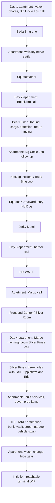

# SquatchSmash release-candidate flow and gap audit

Authoritative production audit for the 2026-08-01 consolidation candidate.
This replaces the pre-heist status and performance numbers in
`CAMPAIGN-AUDIT-2026-08-01.md` and `CONSOLIDATION-HANDOFF.md`.

## Executive assessment

The canonical browser campaign is connected from a fresh apartment wake-up
through every four-day mission and into the Initiation. Campaign schema v9
persists scene, spawn, time, mission checkpoints, inventory, outcomes, and the
shared 97.8 radio state across page loads and browser reloads.

Every production mission before Initiation has a registered entry and a return
or forward edge. THE TAKE is now a real Day Four mission rather than a design
note. The build must still not be called a finished campaign: Initiation is
reachable but intentionally remains `in_progress`, has no durable completion
event, credits/outro, or outbound edge, and is frozen until the owner playtests
and approves its final authored shape.

The demo candidate is therefore **route-complete through the finale entry**, not
campaign-complete. Automated contracts can prove the route and mechanics; a
fresh-save human playthrough is still required to judge pacing, camera work,
first-time landing feel, and the final ceremony.

## Canonical campaign map

The focused fresh-save contract exercises this exact order, performs mission
checkpoint APIs, reloads the save at important seams, and finishes with scene
`initiation`, spawn `gathering`, and mission status `in_progress`. It also proves
that Initiation cannot transition back to the apartment through an unregistered
edge.

## Scene implementation matrix

| Campaign element | Production state | Durable handoff | Key closeout in this candidate | Remaining judgment or gap |
|---|---|---|---|---|
| Day One apartment | Built | Chores + Lou call unlock Bing one | Five-slot inventory; physical phone; shared persistent 97.8 receiver | Human pacing pass from a cleared save |
| Bada Bing one | Built | Package result returns home and unlocks Squatchfather | Shot pour/drink staging; office/bathroom art; powder; shaped coat; real car radio; deterministic DJ opening | Judge shot/camera in motion; DJ request switch is preserved but is not on the normal HotDog route |
| Squatchfather | Built | Package consumed; completion returns home and unlocks sleep | Blood/aftermath continuity and final train-horn cue retained | Human cinematic/audio pass |
| Day Two apartment | Built | Booskibro launches Beef Run; Lou later launches HotDog | Bloody shirt is a full floor garment; closet clothes clear to the side; chapter dressing persists | Judge contrast and closet clearance at target viewports |
| Beef Run | Built | Airstrip, remote strip, returning, landed-home, quality, and completion persist | Higher cockpit sightline; named runway/destination guidance; approach gates/lights; repaired return geometry; expanded contextual Sasole pools; exact VO catalog | Owner still needs to fly the complete back half and judge controls without debug assists |
| HotDog incident / Bing two | Built | Body secure/load gates Graveyard | Dedicated attack, cleanup, wrapped/loaded body, current HotDog route preserved | Older generic second-club recognition beats need redesign if they are revived |
| Squatch Graveyard | Built | Burial unlocks Motel | Physical burial plus optional memorial/tribute/disrespect ledger | Human tone/readability pass |
| Jerky Motel | Built | Outcome returns home and unlocks Day Three sleep | Cargo, freshness, heat, and ending persist | Provisional local-NPC casting still needs voice-lead approval |
| Day Three apartment | Built | Lou's harbor call launches NO WAKE; Margo call later launches Silver | Chapter-specific messages, contact changes, physical phone, radio continuity | Human continuity pass |
| NO WAKE | Built | Betrayal/fire/disposal persist and return home | Boat receiver joins shared 97.8 state; confrontation owns temporary silence; scene-scoped audio | Human pacing and emotional/camera pass |
| Front and Center / Silver Room | Built | Date/performance outcome returns home and unlocks sleep | Waiters carry and set one tracked table; camera follows; fixed marks/walkway; violin + bow; saved woo/date outcome | The desired closing apartment-with-Margo cutscene is not built; Day Four instead opens with her already present |
| Day Four apartment wake | Built | Margo departure + Lou's call unlock Silver Pines | Apartment reflects Tony's rise without exposing the heist loadout early | Judge morning cutscene and room evolution in a full route |
| Silver Pines | Built | Three completed holes return Tony home and expose Lou's heist call | Persistent three-hole scorecard and outcomes; shared inventory; preview/direct-entry/Pages seams | Human shot feel, camera, walk/ride pacing, dialogue repetition, and performance pass |
| Post-golf apartment | Built | Lou's heist call + seven physical prep items unlock THE TAKE | Exact preparation gates appear only after the round | Judge the tonal handoff from quiet status reward to the heist briefing |
| THE TAKE | Built | Six persistent checkpoints; settlement returns home | Briefing, bank, vault, loot, police response, garage, swap, driving, injuries, result, 44 VO + 25 SFX, stable five-slot loadout | Human difficulty/evidence-camera pass |
| Post-heist apartment | Built | Wash/change/hide-gear gates Initiation | Three physical cleanup requirements survive reload | Human handoff pacing pass |
| Initiation | **Terminal WIP** | Entry persists; no completion/outbound | Existing authored scene and shared inventory preserved | Owner playtest and finale decision; then durable oath/completion, outro/credits, callbacks, and regression route |

## Requested-scene closeout

### Beef Run

- The pilot eye is raised and sits above the panel/coaming, giving more sky and
  forward terrain without changing the airplane model.
- Taxi, runway 18 departure, remote-strip approach, Whispering Pines return,
  runway 36 threshold/touchdown, ten approach gates, runway-edge lights, and
  braking prompts all use named physical guidance targets.
- The saved return checkpoint establishes a flyable approach rather than the
  former steep dive. The automated flight verifier must reach touchdown, cue
  braking, stop, record landing quality, and route home on the release commit.
- Captain Lou Sasole has at least six stable-flight barks and at least three
  lines in each contextual final-approach pool: centerline, fast, high, and
  flare. Every spoken Beef Run line has one exact cue; generation/check scripts
  keep the script, manifest, filename, and recording ledger aligned.

### Bada Bing and Booski's shot

- The bartender carries the bottle, pours a visible stream into a rising shot,
  delivers the glass, and waits for `[E]`. The held glass lifts, tilts toward the
  player, drains, and plays its staged audio instead of resolving as a silent
  inventory flag.
- The powder, office art, bathroom art, coat silhouette, and wall clearances are
  fixed. Powder consumption is durable for the visit so its interaction cannot
  respawn after the visual effect ends.
- Day One opens on the smaller Sallie J record. The club pool also contains
  Squatch Up, BooskiBro, and the requested Squatches in the House track. A DJ
  request replaces the actual loop and reports "Request playing".

### Front and Center

- Two staff members visibly carry the same tracked table down the walkway and
  set it at the front-and-center mark while the cutscene camera follows.
- Fixed marks, walkway clearance, camera targets, and performance staging are
  source- and browser-contract surfaces.
- The bandleader has a violin and a separately moving bow rather than a static
  performance pose.

### Apartment and inventory

- Day Two's bloody shirt is a readable multi-part garment on the floor.
- Sliding the closet clothes moves them fully aside and rotates the hangers
  edge-on, clearing access rather than leaving an obstructing half-open rack.
- Every production scene mounts the shared five-slot bottom inventory language.
  Scene loadouts intentionally reset to mission-appropriate contents; carried
  campaign facts and mission outcomes remain durable. Exact-slot consumption
  prevents one duplicate item from deleting another copy.

## Dialogue, voice, music, and effects

`assets/sfx/manifest.json` is the runtime authority and
`VOICE-LINES-TODO.md` is generated from that manifest plus the recorded-file
index. Do not hand-edit the handoff.

The release manifest contains 2,518 cues. Of those, 2,476 have indexed
recordings and 42 exact voice files are in the generated pickup run: 16 for the
Day Four apartment/Golf-call handoff and 26 Silver Pines lines (12
continuity-revised deliveries plus 14 spoken player choices). Those 42 files
represent 41 unique performances because the two machine
announcements deliberately reuse one take. There are zero missing manifest
effects. The 116 future Initiation-party lines are recorded but their party body
is not instantiated by the playable frozen scene; they are correctly separated
from the direct recording run.

All playable authored speech must satisfy three different checks:

1. written line to exact manifest cue;
2. exact cue to indexed file, or an explicit entry in the generated pickup list;
3. scene selector to decoded playback for every resident cue the scene can ask
   for.

Subtitles and duration fallback keep a missing pickup playable, but "wired" is
not the same as "recorded." `VOICE-LINES-TODO.md` is the exact 42-file direct
delivery list; `npm run audio:todo:check`, `npm test`, and `npm run check`
enforce that it remains synchronized with the runtime.

## Repository reconciliation

The production source of truth is `main`. Merged PR work was compared by patch
and content rather than assuming a later timestamp meant better code. The
remaining remote feature branches were compared at their exact tips and were
not treated as safe wholesale merges:

- `codex/beef-run-runway-start` contains useful Bing visual/music/radio ideas
  mixed with an older tree that would delete 78 current radio recordings and
  restore obsolete route/audio behavior. Only the compatible visual, music,
  and persistent-radio semantics were ported.
- `agent/remaining-audio-20260801` supplied the missing footsteps, heist bank,
  Counter-Squatch recordings, and a late monitored batch containing the final
  seven Bada Bing pickups. Canonical assets were selectively integrated and the
  derived index/TODO rebuilt; stale Golf/radio metadata was not merged.
- `agent/family-interactions-20260801` supplied selected character interactions,
  but its global identity rename and frozen Initiation edits conflict with the
  current campaign and were intentionally not merged wholesale.
- `codex/hotdog-graveyard-20260801` supplied the current graveyard controls and
  presentation work, which was selectively ported and verified.

Silver Pines was selectively integrated from the latest start-gate-fixed
archive rather than merged wholesale. Its three-hole course and authored
dialogue were adapted to the current campaign identity, shared inventory,
scene-scoped audio, preview, verification, and GitHub Pages contracts. It is now
release canon between the Day Four wake and THE TAKE. Historical checkpoints
remain protected by archive tags; obsolete feature and imported working refs
can be retired only after the consolidation commit is on `main` and live.

Never copy or inspect the external `ElevenlabsAPi.txt` found in an older audit
folder. It is outside the repository and must not enter Git; rotate the key if
it is still live.

## Severity and gap ledger

| Severity | Gap | Consequence | Close condition |
|---|---|---|---|
| P1 | Initiation has no durable completion/outro/outbound edge | The campaign cannot honestly claim completion | Owner approves the finale; implement oath/result/callbacks, completion state, credits/outro, and fresh-save browser route |
| P2 | No full fresh-save human playthrough on this exact candidate | Automated contracts cannot judge fun, pacing, camera comfort, or first-time control readability | Owner/friend plays the deployed commit and logs route/scene notes |
| P2 | Beef Run landing, Front-and-Center staging, and Silver Pines shot/pacing feel need human review | Source and automation can pass while the experience still feels awkward | Full return landing without assists; watch table/shot/performance without skipping; play all three holes in route |
| P2 | Front-and-Center closing apartment cutscene is absent | Margo continuity jumps from the venue result to the Day Four opening | Author and build the short closing beat, or approve the current intentional ellipsis |
| P2 | Initial audio/art payload remains larger than necessary | Long waits and memory pressure on weaker machines | Finish scene banks, optional apartment lazy banks, streaming music, fast-start video, optimized runtime art, and budgets |
| P3 | DJ request exists only in a legacy fallback path | The improved switch is not visible in the normal connected campaign | Intentionally add a Day One/HotDog request beat or leave it as preserved infrastructure |

## Performance and packaging

The measured Pages staging audit is 2,986 files / 221.77 MiB; assets are
215.16 MiB. The current manifest-owned recorded bank is 2,476 files /
115.01 MiB. Decoding the entire bank still expands past a gigabyte of PCM. The
web platform is not the root problem; eager audio decoding and oversized
runtime art are.

This release scopes every production mission loader and reduces the Apartment
resident plan from 1,343 clips / 66.49 MiB to 864 clips / 43.19 MiB. Apartment
Start now blocks only on automatic opening cues plus the exact live radio hour;
the post-heist handoff measured 104 clips / 6.86 MiB before control, while the
remaining resident bank continued in the background. THE TAKE explicitly
closes and releases its finished audio graph before loading the Apartment.

The browser remains canonical. First finish no-loss scene audio selection,
stream long music, fast-start video, and right-sized runtime art. Then add an
installable PWA to the same GitHub Pages origin with commit-versioned caches,
small shell precache, next-scene prefetch, update-at-scene-boundary behavior,
and explicit offline download controls. See `WEB-PERFORMANCE-AND-PWA.md`.

Tauri is an optional later Windows wrapper of the exact staged web build. It is
useful for a guaranteed offline installer, not as a substitute for payload and
runtime optimization. Electron is unnecessary unless exact bundled Chromium or
Node behavior becomes a requirement.

## Release verification checklist

The release record must attach results to one exact commit after all selected
work is committed. A source-only "looks right" review is insufficient.

- [x] Core Node suite passes outside the Windows process-spawn sandbox.
- [x] Static `npm run check` passes with every generated ledger current.
- [x] Fresh-save campaign-route contract reaches Initiation `in_progress`.
- [x] Voice generators/checks and `audio:todo:check` pass.
- [x] Day One, Day Two, Big Night, direct-entry, boot-error, preview, and bundle
      contracts pass.
- [x] Bing one, HotDog/Bing two, Squatchfather, Beef Run, Motel, Graveyard,
      NO WAKE, Silver, heist, and Initiation browser contracts pass.
- [x] Silver Pines three-hole, preview, direct-entry, and route contracts pass
      on the final release commit.
- [x] Beef Run verifier proves exact voice cues, contextual Sasole pools,
      destination guidance, saved-return setup, touchdown/braking, completion,
      and home route.
- [x] Every production scene shows the shared five-slot inventory contract.
- [ ] Pages deploys the exact `main` SHA; cache-busted live HTML/assets match it.
- [ ] Owner/friend completes a fresh-save human demo and records experience
      notes; Initiation remains explicitly WIP until separately approved.

## Prioritized finish plan

1. Commit and verify the consolidated radio/music/audio-selector candidate.
2. Refresh `origin/main`, reconcile any movement, fast-forward/merge the exact
   verified commit to `main`, push, and wait for Pages.
3. Confirm the live cache-busted demo and then retire only proven-obsolete
   remote branches/worktrees/imported refs; preserve archive tags.
4. Give the voice lead the generated 42-file pickup run (41 unique
   performances) and reverify the delivered recordings.
5. Conduct the fresh-save owner/friend playthrough, with special attention to
   Beef Run's return landing, Booski's shot, Front and Center, all three Silver
   Pines holes and their heist handoff, and THE TAKE.
6. Resolve the Initiation design after that playtest; implement its durable
   completion/outro and final campaign route.
7. Complete the measured web optimization order, then ship the PWA; add Tauri
   only if a separate offline installer is still useful.
