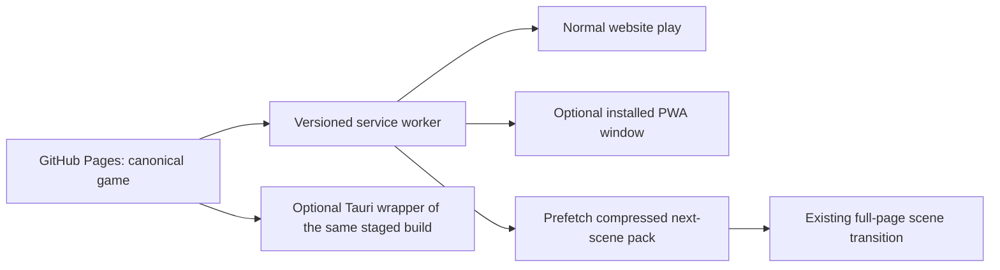

# Web performance, PWA, and desktop map

Updated 2026-08-01 from the production Pages staging list and local cold-load
measurements.

## Decision

The browser build remains canonical. The immediate performance problem is not
"being a website": it is loading and decoding far more audio and larger runtime
art than each scene needs. Fix those payloads first, then make the same website
installable as a Progressive Web App (PWA). A Tauri package can follow as an
optional offline Windows release built from the exact same staged files.

Nothing about the PWA requires a second game, second save format, or different
URL. A player visits the normal GitHub Pages site and can optionally choose
Install/Add to Home Screen. Existing full-page scene transitions should remain:
they release each scene's WebGL and decoded-audio memory, while cached files make
the next page local and fast.

## Measured production payload

The current Pages job stages 2,662 files totaling 211.67 MiB. Assets account for
205.41 MiB:

| Runtime group | Staged size |
|---|---:|
| Sound effects and voice | 112.55 MiB |
| Art | 42.15 MiB |
| Music | 28.12 MiB |
| Video | 13.79 MiB |

The JavaScript entry closures are comparatively small. Rebundling or switching
engines does not address the dominant transfer, decode, and memory costs.

A local cold, no-click trace measured the files each page asks for before the
player presses Start. These are raw local bytes, not WAN timing claims:

| Page | Requests | Initial bytes |
|---|---:|---:|
| Apartment | 134 | 11.47 MiB |
| Bada Bing one | 86 | 24.27 MiB |
| HotDog / Bada Bing two | 66 | 23.05 MiB |
| Beef Run | 46 | 3.06 MiB |
| Initiation | 36 | 3.04 MiB |
| Graveyard | 44 | 2.20 MiB |
| NO WAKE | 48 | 1.52 MiB |
| Other production scenes | 22–53 | 1.05–1.75 MiB |

## Audio is the first-order problem

The recorded manifest currently contains 2,176 cues, 105.36 MiB compressed and
about 1.93 hours long. Decoding the whole bank requires about 1,150 MiB of
mono 44.1-kHz Float32 PCM; stereo recordings can double that estimate.

| Loader | Cues made resident | Compressed | Minimum decoded PCM |
|---|---:|---:|---:|
| Apartment resident plan | 864 | 43.19 MiB | about 480 MiB |
| Post-heist Apartment start gate | 104 | 6.86 MiB | bounded opening bank |
| Bada Bing | 493 | 23.05 MiB | about 254 MiB |
| Front and Center | 381 | 21.87 MiB | 241 MiB |
| Beef Run | 281 | 12.40 MiB | 137 MiB |
| Unscoped base engine | 2,176 | 105.36 MiB | about 1,150 MiB |

Before this release pass, HotDog and Graveyard awaited the entire unscoped bank
and NO WAKE decoded it in the background. Their authored banks are only about
1.25 MiB, 1.34 MiB, and 2.15 MiB respectively, plus small shared-effect sets.
Every production scene must select its exact cue names/prefixes and have a test
that proves every requested recording is included. A missing cue is a test
failure, not an excuse to retain the global bank.

The Apartment now removes 479 proven mission-owned recordings (23.30 MiB),
retains an 864-cue resident contract, and opens on a small automatic/chapter
bank while the optional activity/PC library continues in the background. A
later pass can make those optional banks fully interaction-lazy.

A service worker caches compressed MP3 bytes. It cannot persist decoded
`AudioBuffer` objects, so a PWA alone cannot solve this CPU and memory cost.

## No-loss optimization order

1. Scope HotDog, Graveyard, and NO WAKE audio and enforce selector coverage.
   **Landed in this release.**
2. Remove mission-only recordings from the Apartment and phase the opening bank.
   **Landed in this release; interaction-level lazy loading remains optional.**
3. Stream long music through an `HTMLAudioElement`/WebAudio gain path while
   retaining decoded one-shot effects and speech.
   **Landed in this release.** Bada Bing's two opening records previously held
   4,098,038 compressed bytes as about 61.6 MiB of decoded stereo Float32 PCM.
   They now retain zero music `AudioBuffer` PCM while still entering the same
   positional gain/filter/ducking graph. The browser may still download the
   compressed MP3; the win is incremental decode and bounded playback memory.
4. Relocate `hog-mamas-show.mp4` metadata to the front with FFmpeg
   `-c copy -movflags +faststart`; this changes no video frames.
   **Landed in this release.** The `moov` box moved from byte 7,364,221 to byte
   32 (96.62% fewer bytes before playback metadata). File size remains
   7,621,825 bytes, all 7,969 video and 11,444 audio packets remain, and the
   encoded video/audio stream hashes are unchanged.
5. Generate visually verified, right-sized runtime art while retaining source
   originals outside the staged runtime. Seven older 1122 x 1402 family WebPs
   are about 1.37–1.48 MiB each; the equally sized optimized DeathMegatron WebP
   is about 0.24 MiB, showing an approximately 8-MiB Bing opportunity without
   removing art or dimensions.
6. Enforce budgets in CI: no full SFX-bank scene, complete selector coverage,
   page cold-byte limits, MP4 fast-start, art dimensions/file sizes, and an
   offline next-scene transition.

## PWA rollout

1. Add `manifest.webmanifest`, 192/512/maskable icons, and root `sw.js`.
2. Register with relative GitHub Pages paths: `./sw.js`, scope `./`, start URL
   `./index.html`.
3. Inject the deployed Git commit SHA into every cache name during Pages
   staging. Never use an unversioned "latest" cache.
4. Precache only the small shell and shared code, not all 211 MiB.
5. Runtime-cache compressed scene assets. After a mission settles, prefetch the
   exact next scene pack in the background.
6. Bypass HTTP Range requests initially so streamed audio/video cannot be
   corrupted by a naive cache response.
7. When a new worker is ready, show "Update ready" and activate on a reload or
   scene boundary. Do not replace code beneath a running scene.
8. Offer explicit "Download next scene" and later "Download full campaign"
   controls after checking `navigator.storage.estimate()`; do not silently take
   hundreds of megabytes.

The result is still the website. Online players receive normal updates. An
installed player gets a standalone window and can replay cached scenes offline.

## Optional Tauri release

Tauri should package the exact Pages staging directory as an optional GitHub
Release after the PWA pass. It provides a Windows installer, native fullscreen,
and guaranteed bundled offline files while using the operating system webview.
It does not inherently fix oversized art, eager audio decode, frame time, or
game logic.

The PWA is the better friend-demo path because it keeps the same URL/origin,
shares the existing browser campaign save, and updates from Pages. A Tauri build
has separate local storage unless save export/import or synchronization is
added. Electron is only justified if the game later requires a bundled exact
Chromium version or Node APIs; neither is currently required.

The current single-file preview bundle is not a replacement: it intentionally
cuts/re-encodes media to fit a small preview budget and does not preserve the
lossless full campaign.

## Reference implementation guidance

- [MDN: caching resources with a service worker](https://developer.mozilla.org/en-US/docs/Web/Progressive_web_apps/Guides/Caching)
- [Tauri: frontend configuration](https://v2.tauri.app/start/frontend/)
- [Tauri: application size](https://v2.tauri.app/concept/size/)
- [Electron documentation](https://www.electronjs.org/docs/latest/)
